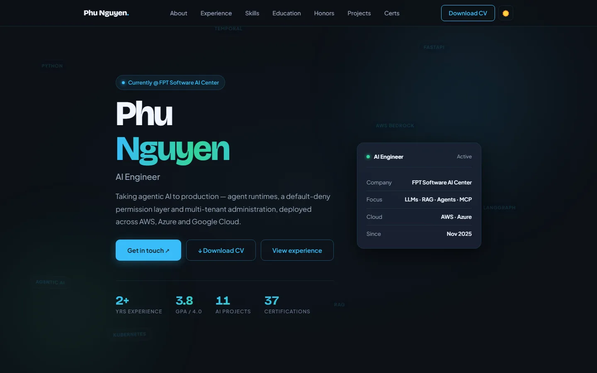
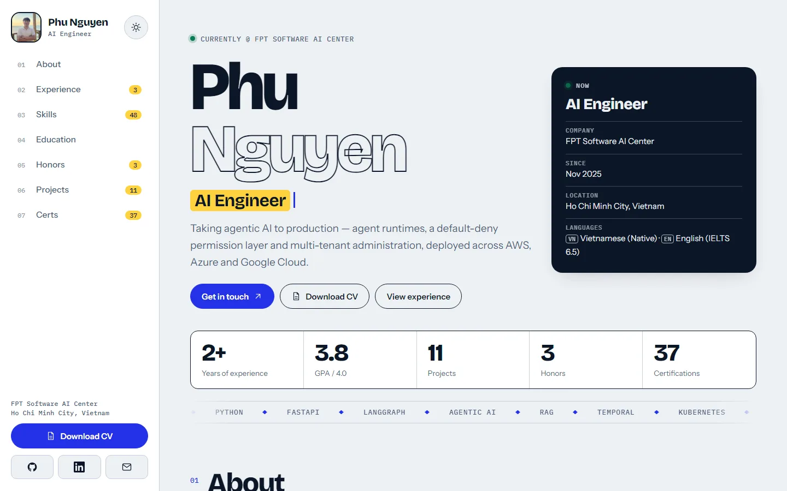
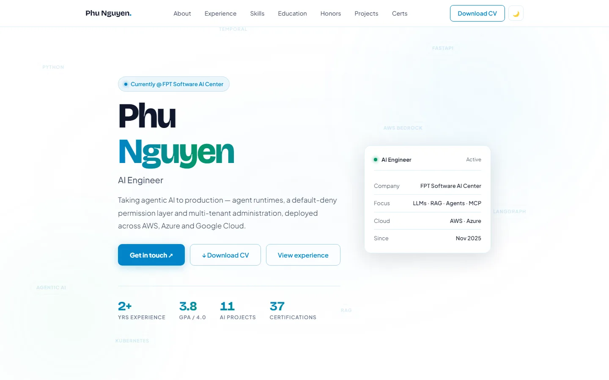
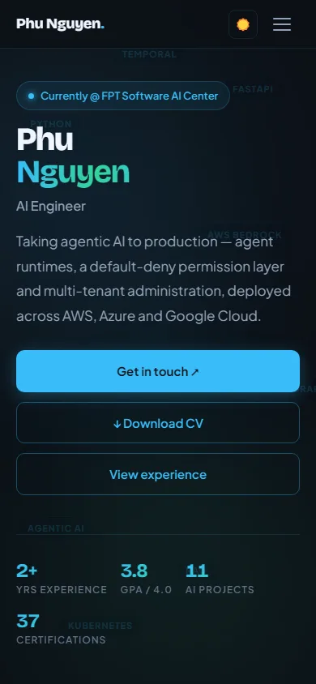
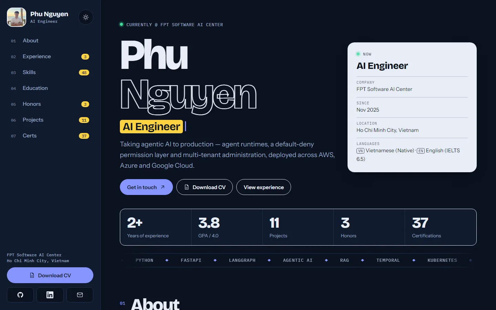
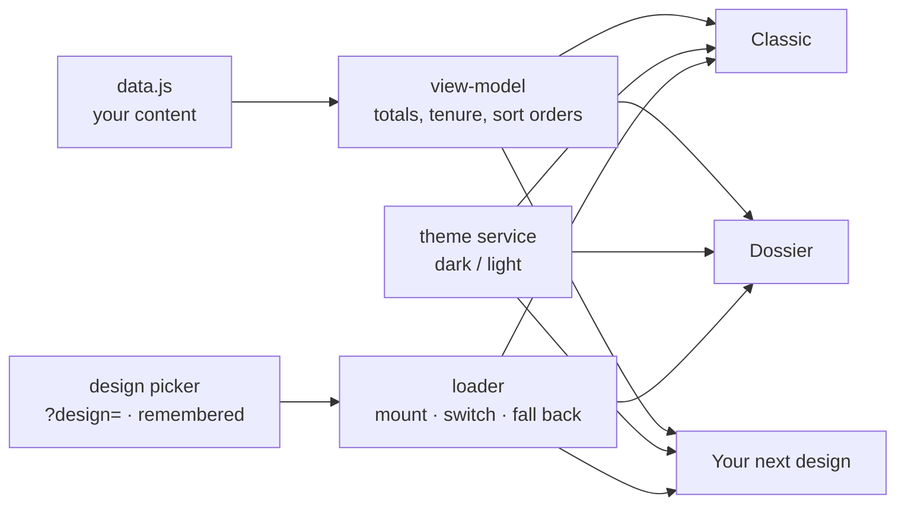

<div align="center">

# Phu Nguyen — Portfolio

**A résumé site you edit in one file, and re-skin with one click.**

[](https://github.com/pdz1804/pdz1804.github.io/actions/workflows/quality.yml)


**Live:** <https://pdz1804.github.io/> · **Dossier design:** <https://pdz1804.github.io/?design=dossier>

 

</div>

Hand-built static site: **no framework, no build step, no dependencies.** Every word, number and
badge comes from one content file ([`assets/js/data.js`](assets/js/data.js)); the page renders itself
from it. Add a job, a project or a certification and the counters, the numbering, the filters and the
"Show all N" buttons update on their own.

## Designs

The same data, several complete designs. **Use the *Design* picker at the bottom of the page and the whole
site re-skins instantly**: no reload, nothing to edit. (The one exception: on the separate `projects.html` page, picking Dossier opens the landing page's Projects section, because Dossier keeps everything on one page.) On a phone it is the small ◐ button in the bottom-left
corner. Your choice is remembered, and a link with `?design=<id>` opens a specific design for that visit
(it does not overwrite your saved choice). `site.defaultDesign` in `data.js` only sets what a first-time
visitor sees.

<!-- designs:start -->
| Design | Dark | Light | Phone |
|---|---|---|---|
| **Classic**<br>Centred sections, animated hero, particle field<br>`?design=classic` |  |  |  |
| **Dossier**<br>Profile rail, section index with live counts, filterable lists<br>`?design=dossier` |  |  |  |
<!-- designs:end -->

Every design supports **light and dark** themes, phone to desktop widths, and reduced motion. Designs only
*present* data; they never own it, so switching designs can never change what the résumé says.

## Quick start

```sh
# 1. just open it (works from file://, no server needed)
open index.html

# 2. or serve it exactly like GitHub Pages
python -m http.server 8080      # → http://localhost:8080
```

## Make it yours (5 minutes)

> You do **not** need to touch HTML, CSS or any design folder. Everything personal lives in
> **`assets/js/data.js`** and a handful of files you replace.

### 1. Edit your content in `assets/js/data.js`

| Section in the page | Key in `data.js` | What you fill in | What updates by itself |
|---|---|---|---|
| Name, role, tagline, contact | `profile` | `fullName`, `displayName`, `heroName`, `title`, `company`, `location`, `email`, `github`, `linkedin`, `tagline`, `typedRoles`, `availability`, `languages`, `resume` | hero, footer, contact cards, typed roles |
| Years of experience | `profile.careerStart` | `'YYYY-MM'` of your first role | the "Yrs Experience" stat recomputes every day |
| About | `about` | `photo`, `paragraphs` (inline `<strong>` allowed), `specialties` (`icon`, `title`, `desc`) | cards and highlights |
| Work experience | `experience[]` | company → `roles[]` with `title`, `type`, `period`, `start`, `end`, `bullets`, `awards`, `evidence` | tenure ("1 yr 5 mos"), "Current" pill, newest-first order |
| Skills | `skills[]` | groups of `items[]` with `name`, `level`, `years` | bar length from `level` (never a hand-typed %) |
| Education | `education[]` | `institution`, `degree`, `period`, `details`, optional `gpa`, `docs` | GPA block, document links |
| Honors & awards | `honors[]` | `title`, `issuer`, `date`, `sortKey`, `description`, `evidence[]` | photo carousel when you add 3+ images |
| Projects | `projects.professional[]`, `projects.academic[]` | `title`, `period`, `bullets` / `desc`, `tags`, `link`, `featured` | project counter, numbering, tag filters |
| Certifications | `certifications[]`, `certIssuers` | `issuer`, `name`, `date`, `sortKey` (integer `YYYYMM`) | counter, issuer filter chips, "Show all N" |
| Navigation, ticker | `nav`, `floaters` | labels and tech words | menus and the hero ticker |
| Site and designs | `site` | `url`, `ogImage`, `defaultDesign`, optional `designs` (allow-list and order), `switcher.enabled`, `credit` | which design visitors see first, whether the picker shows |

Dates are `'YYYY-MM'`; `end: null` marks your current role. Text fields accept inline HTML; write
`&amp;` for a literal ampersand.

### 2. Replace the files that are *yours*

| Replace | Where |
|---|---|
| Profile photo | `images/PDZ.jpg` (keep the name or change `about.photo`) |
| Company / school logos | `images/*logo*.png` (referenced by `experience[].logoDark` / `logoLight`) |
| Certificates and photos | `images/evidence/` (strip metadata first: `magick in.jpg -auto-orient -strip out.jpg`, max 2048 px) |
| Résumé download | `assets/cv/Nguyen_Quang_Phu_CV.pdf` (point `profile.resume.path` at your file; set `enabled: false` to hide the button) |
| Documents | `assets/docs/` (the sample transcript is mine: **delete it**, don't ship it) |
| Favicons / app icons | `favicon.svg`, `icons/` |

### 3. Sync the page identity (social cards, search engines)

The canonical URL, social-card image, JSON-LD identity, sitemap, `robots.txt`, web manifest and 404 title
have to be real text in real files, because crawlers do not run JavaScript. One command copies them from
`data.js`:

```sh
node tools/sync-meta.js --write   # fix any drift (run without --write to only check)
node tools/validate-data.js       # catches the mistakes an edit realistically introduces
node tools/check-published.js     # forbidden names, PDFs, photo metadata, broken links
```

The meta *description*, the Open Graph description and the `<noscript>` note are copy you write by hand in
`index.html` and `projects.html`.

### 4. Adjust the project-specific checks

`tools/check-published.js` has a `FORBIDDEN` list (client names that must never appear) and an
`ALLOWED_PDFS` list. Replace them with yours. `tools/verify-design.js` and `tools/verify-browser.js` carry the
same forbidden-name list. The site host is read from `site.url`.

### 5. Publish

Name the repository `<your-username>.github.io`, then **Settings → Pages → Deploy from branch →
`main` / root**. That is the whole deployment.

> **Forking this exact repo?** Remove my personal material first: `images/evidence/`, `assets/cv/`,
> `assets/docs/`, `images/PDZ.jpg`, the logos, and the entries in `data.js`. There is no neutral starter
> data file yet; replace the entries in place.

## How it works



Shared logic lives **once** in the view-model; a design is mostly markup and styling. That is why a new
design is cheap and why two designs cannot disagree about a number. If a design fails to load, the page
still contains a complete Classic version, so a visitor is never left with a blank screen.

## Add a design

```sh
node tools/new-design.js aurora "Aurora"        # scaffold designs/aurora/ and register it
DESIGN=aurora node tools/verify-design.js       # the contract suite; the starter already passes
node tools/capture-designs.js                   # screenshots + the gallery above
```

The scaffold already shows every section, so the suite passes before you style anything. Rules and the
view-model reference are in [`docs/DESIGNS.md`](docs/DESIGNS.md).

## Project layout

```
index.html / projects.html   thin shells: meta, <noscript>, the static Classic page inside #app, boot scripts
assets/js/data.js            ← the content (the one file you edit)
assets/js/core/              boot (design + theme choice), view-model, loader, switcher
assets/css/switcher.css      the picker and the load-failure banner
designs/registry.js          one entry per design
designs/classic/ dossier/    the designs
assets/cv/ assets/docs/      downloads
images/ icons/               photo, logos, evidence, favicons
tools/                       validators, browser suites, scaffolds, screenshot capture
docs/                        HANDOFF.md, DESIGNS.md, screenshots/
```

## Quality gates

CI (`.github/workflows/quality.yml`) runs on every push and pull request. Pages deploys from `main` by
itself, so CI *reports* after the fact; a red run means something live needs fixing.

| Gate | Command | Catches |
|---|---|---|
| Content | `node tools/validate-data.js` | bad dates, missing issuer badges, unknown skill levels, dead nav links, a `site` block that points at a missing design |
| Static meta | `node tools/sync-meta.js` | canonical, social image, JSON-LD, sitemap, manifest drifting from `data.js` |
| Published files | `node tools/check-published.js` | forbidden names, phone-like numbers, PDF text layers, photo EXIF, size budgets, broken references |
| View-model | `node tools/test-view-model.js` | tenure, sorting, totals, empty data |
| Per design | `DESIGN=<id> node tools/verify-design.js` | every datum shown, injected data appears, a11y, overflow at four widths, both themes, switch leaks |
| Switching | `node tools/verify-switching.js` | live switch, scroll and focus kept, fallbacks, no-JS, `file://` |
| Browser suites | `node tools/verify-browser.js`, `node tools/verify-devices.js` | 98 + 90 checks across devices, touch targets, themes |

The browser suites need Playwright, which is *not* a dependency of the site: `npm install --no-save playwright`.
Classic is guarded by a pixel diff against its pre-switcher screenshots
(`tools/capture-golden.js` + `tools/compare-golden.js`, a local tool that needs ImageMagick).

## Conventions worth keeping

- `sortKey` is an integer `YYYYMM` (`202606`), never a decimal.
- Exactly one role has `end: null`. Roles render newest first, so `push()` is safe.
- Skill widths come from `level` through `SKILL_LEVELS`; never hand-tune a percentage.
- Every colour is a **token**. Themes redefine tokens only; components never hard-code a hex value. New designs are linted for this strictly. Classic predates the rule: `tools/design-baselines.json` records its existing exceptions (47 colour literals, 3 `[data-theme]` component rules) and the suite fails if they grow.
- Photos in `images/evidence/` are metadata-stripped and ≤ 2048 px (phones embed GPS).
- `service-worker.js` is a tombstone that unregisters an old worker; do not delete it on a site that ever
  shipped one. See [`docs/HANDOFF.md`](docs/HANDOFF.md) for the gotchas learned the hard way.

## Updating the CV download

`assets/cv/Nguyen_Quang_Phu_CV.pdf` is a **phone-free** build of the full CV: the source in
`D:\Personal\CV\...\CV_full` keeps the phone number, which should not go on a public, crawlable page. To
refresh it after a CV change, copy the source folder, delete the `(+84) …` fragment from the header block in
`CV_full.tex`, run `pdflatex` twice, and copy the PDF over. Set `profile.resume.enabled` to `false` to hide
the download button everywhere without removing the file.

## Licence

Code: [MIT](LICENSE). The personal content (text, photos, certificates, CV, logos) is © Nguyen Quang Phu
and is not licensed for reuse; replace it with your own when you fork.

## Credits and contact

Previously built on the [masterPortfolio](https://github.com/ashutosh1919/masterPortfolio) template by
Ashutosh Hathidara; none of that code remains.

[GitHub](https://github.com/pdz1804) · [LinkedIn](https://www.linkedin.com/in/quangphunguyen/) ·
[Email](mailto:quangphunguyen1804@gmail.com)

<sub>Phu Nguyen — HCMC, VN</sub>
