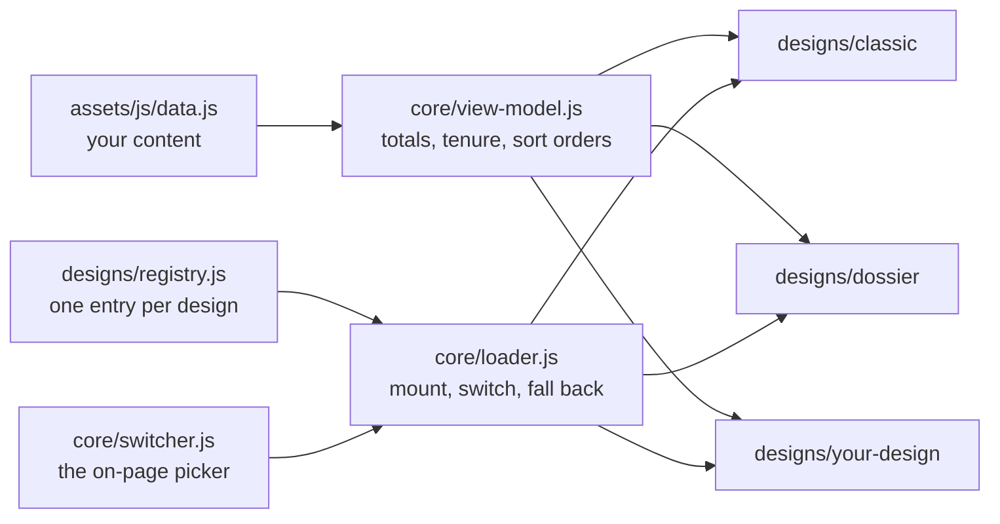

# Designs

The site can look like more than one thing. Each look is a **design**: a folder under
`designs/` that draws the same data (`assets/js/data.js`) its own way. Visitors switch
between them with the picker on the page, with no reload and no code edit. (One exception: on `projects.html`,
picking a design that has no such page, like Dossier, opens `index.html#projects` instead.)



## Add a design in two minutes

```sh
node tools/new-design.js aurora "Aurora"
DESIGN=aurora node tools/verify-design.js     # the starter already passes
```

Open `index.html?design=aurora` (or use the picker). Restyle `designs/aurora/main.css`
and the markup in `designs/aurora/design.js`. Nothing else needs to change: the picker,
the CI matrix and the checks all read the registry.

## The contract

A design is a manifest in `designs/registry.js` plus an implementation that registers
itself:

```js
// registry.js
api.add({
  id: 'aurora', name: 'Aurora', description: 'One line for the picker tooltip',
  pages: ['home'],                                  // which pages it can render
  redirect: { projects: 'index.html#projects' },    // where an unsupported page goes
  fonts: ['https://fonts.googleapis.com/css2?...'], // optional, requested but never awaited
  css: ['designs/aurora/main.css'],
  js: ['designs/aurora/design.js'],
});

// design.js
PortfolioDesigns.implement('aurora', {
  mount(root, ctx) { /* fill root, start behaviour */ },
});
```

`ctx` is everything a design needs:

| Field | What it is |
|---|---|
| `ctx.data` | the `PORTFOLIO` object from `data.js` |
| `ctx.vm` | derived figures: `totals`, `currentRole`, `currentCompany`, `experience[]` (with tenure), `honors[]`, `certs[]`, `skills[]` |
| `ctx.life` | start **every** listener, timer, frame loop and observer through it, so switching away undoes them |
| `ctx.theme` | shared light/dark service: `get()`, `set()`, `toggle()`, `onChange(fn)` |
| `ctx.ready(fn)` | run `fn` once the window has loaded |
| `ctx.page` | `'home'` or `'projects'` |

### Rules that keep switching safe

1. **Use `ctx.life`**, never a bare `addEventListener`/`setTimeout`/`requestAnimationFrame`
   that nothing cancels. The leak test switches 10 times and fails if anything accumulates.
2. **Keep the shared section ids**: `hero about experience skills education honors projects certifications contact`.
   They are how a visitor keeps their place when switching.
3. **Colours are tokens.** The light theme redefines tokens only: no `[data-theme=…] .component` rules and
   no colour literals outside `:root` blocks. The contract suite lints this strictly for new designs; Classic
   has a recorded baseline in `tools/design-baselines.json` that may not grow.
4. **Derived numbers come from `ctx.vm`**, not re-computed in the design.
5. **Text fields in `data.js` are trusted HTML** (they carry `<strong>` and entities). URLs and other
   attribute values must be escaped.
6. **Do not edit another design's files.** A design owns its folder.

## What the platform does for you

- **Fallback:** the HTML ships a complete Classic page inside `#app`. If a design fails to load or takes
  more than 5 s, the loader mounts Classic and shows a banner. If the loader itself dies, a 7 s guard in
  `boot.js` reveals the static page and its stylesheet (there is no banner in that case, because the banner
  is the loader's).
- **Choosing:** `?design=<id>` wins for that visit but is not remembered; only the picker saves a choice
  (`localStorage` key `nqp-design`). Unknown ids fall back to `site.defaultDesign`.
- **Picker:** shown when `site.switcher.enabled` is true (`?switcher=0` / `?switcher=1` override).
- **Theme:** one saved choice (`nqp-theme`) shared by every design.

## Checks

| Command | Proves |
|---|---|
| `DESIGN=<id> node tools/verify-design.js` | all data shown, injected data appears, edge data, a11y basics, no overflow at 390/768/1024/1440, reduced motion, CSS rules, switch-leak test |
| `node tools/verify-switching.js` | live switching, scroll/focus kept, fallbacks, no-JS, `file://` |
| `node tools/test-view-model.js` | the derivations, with a fixed clock |
| `node tools/sync-meta.js` | canonical/OG/JSON-LD/sitemap/manifest equal `data.js` (`--write` fixes) |

CI builds its matrix from `node tools/list-designs.js`.

Classic must stay pixel-identical to the pre-switcher site. `tools/capture-golden.js` and
`tools/compare-golden.js` freeze and diff screenshots plus section text (local tool; needs ImageMagick).
